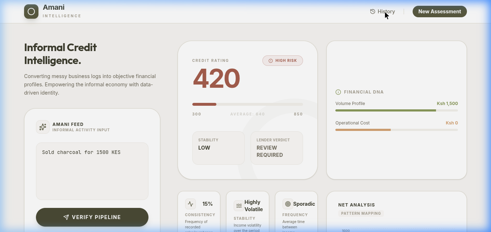

<div align="center">

# 🌊 Kredia.AI
**Empowering the Informal Economy with AI-Driven Credit Intelligence.**

[](https://react.dev/)
[](https://vitejs.dev/)
[](https://www.typescriptlang.org/)
[](https://firebase.google.com/)
[](https://ai.google.dev/)
[](https://tailwindcss.com/)

> **Vision**: To unlock financial dignity for billions by transforming messy, everyday integrity into a global language of credit.

*Traditional credit systems fail the informal sector because they ignore the pulse of the local market. Kredia.AI bridges this gap by converting messy, unstructured business logs into objective, machine-readable credit profiles for micro-entrepreneurs and SMEs.*

</div>

---

## 📋 Table of Contents
- [🌊 Overview](#-overview)
- [🎯 Theme Alignment: AI for Finance](#-theme-alignment-ai-for-finance)
- [🏗 Final Architecture](#-final-architecture)
- [📸 How to Operate (Live Demo)](#-how-to-operate-live-demo)
- [✨ Features](#-features)
- [🛠 Tech Stack](#-tech-stack)
- [🚀 Development Journey](#-development-journey)
- [⚡ Quick Start](#-quick-start)
- [🏭 Running in Production](#-running-in-production)
- [🔑 Environment Variables](#-environment-variables)
- [🔌 API Reference](#-api-reference)
- [📁 Project Structure](#-project-structure)
- [📊 Current Status](#-current-status)
- [🗺 Roadmap](#-roadmap)
- [🤝 Contributing](#-contributing)
- [📄 License](#-license)

---

## 🌊 Overview
Kredia.AI is a lightweight AI prototype built to solve the **"Invisible Credit"** problem in the informal economy. While billions of kenya shillings flow through side-hustles, Chamas (informal savings groups), and micro-businesses, these entrepreneurs remain unbankable because their financial history exists only in unstructured formats: **M-Pesa SMS logs, notebook entries, and verbal agreements.**

Kredia.AI acts as an intelligence bridge, using Large Language Models to convert these alternative data traces into high-fidelity, machine-readable credit profiles.

---

## 🎯 Theme Alignment: AI for Finance
This project was specifically engineered to address the **AI for Finance** thematic track by focusing on the transition from alternative data to financial trust.

### 📱 Utilization of Alternative Data
Instead of relying on traditional CRB (Credit Reference Bureau) reports, Kredia.AI uses:
*   **Simulated M-Pesa Patterns**: Parsing text-based transaction records (e.g., "Received 2000 from Jane Doe" or "Paid 800 for electricity") to establish cash flow.
*   **SMS Business Records**: Transforming the messy "Inbox" of a mama mboga or side-hustler into a digital ledger.
*   **Chama Contribution Traces**: Identifying regular payments to social savings groups as a proxy for financial discipline and community-vetted reliability.

### 📈 Predicting Creditworthiness for Side-Hustles
For a side-hustle, raw income isn't the only metric. Kredia.AI's scoring engine rewards:
1.  **Consistency (Reliability)**: Regular inflows, even if small, indicate a stable business model.
2.  **Spending Discipline (Burn Rate)**: Managing expenses relative to income, a key indicator for Chama sustainability.
3.  **Financial Resilience (Volatility)**: Understanding seasonal dips and peak periods in the local market.

### 🤝 Empowerment for Chamas
Kredia.AI provides Chamas with an objective tool to assess potential members. By analyzing a member's "Integrity Traces," a Chama can make data-driven decisions on loan disbursements without requiring formal collateral.

---

## 🏗 Final Architecture
Kredia.AI operates on a **Decentralized Agentic Workflow**, where the Gemini Orchestrator manages multiple specialized intelligence layers to ensure precision in alternative data processing.

```text
    ┌─────────────────────────────────────────────────────────────┐
    │                    KREDIA AGENTIC ECOSYSTEM                 │
    └─────────────────────────────────────────────────────────────┘
                │                           │
      [ ALTERNATIVE DATA ]         [ AGENTIC UI LAYER ]
      ( M-Pesa/SMS/Logs )         ( React/Framer Motion )
                │                           │
                ▼                           ▼
    ┌─────────────────────────────────────────────────────────────┐
    │             GEMINI INTELLIGENCE ORCHESTRATOR                │
    ├─────────────────────────────────────────────────────────────┤
    │  ┌──────────────────┐           ┌──────────────────┐        │
    │  │  EXTRACTION      │           │  BEHAVIORAL      │        │
    │  │  AGENT (NLP)     │ ────────▶ │  ANALYSIS AGENT  │        │
    │  └──────────────────┘           └──────────────────┘        │
    │          │                               │                  │
    │          ▼                               ▼                  │
    │  ┌──────────────────┐           ┌──────────────────┐        │
    │  │  CONTEXTUAL      │           │  NEURAL SCORING  │        │
    │  │  PROCESSOR       │ ◀──────── │  LOGIC LAYER     │        │
    │  └──────────────────┘           └──────────────────┘        │
    └─────────────────────────────────────────────────────────────┘
                │                           │
                ▼                           ▼
    ┌───────────────────────────┐   ┌───────────────────────────┐
    │   CLOUD PERSISTENCE HUB   │   │   LENDER DECISION ENGINE  │
    │   (Google Firestore)      │   │   (Narrative Generation)  │
    └───────────────────────────┘   └───────────────────────────┘
```

### 🧠 The Intelligence Framework
*   **Extraction Agent**: A specialized prompt-engineered instance of Gemini that performs high-fidelity Named Entity Recognition (NER) on colloquial financial text.
*   **Behavioral Analysis Agent**: Evaluates the *velocity* and *consistency* of transactions to map business stability.
*   **Neural Scoring Layer**: A deterministic logic layer that weights AI-extracted features into a standardized 300-850 score.
*   **Cloud Persistence Hub**: A real-time, distributed NoSQL layer (Firestore) that ensures a permanent, immutable credit history for the trader.

---

## 📸 How to Operate (Live Demo)
Kredia.AI is designed to be intuitive for judges and lenders alike. Here is how you can operate the application during the live demo:

### 1. The Assessment Dashboard
When you launch the app, you are greeted with the **Amani Intelligence** dashboard. 
- You can manually type in a trader's logs (e.g., "Sold charcoal for 1500 KES") or click the **"Full Profile Sample"** button to load a pre-configured set of alternative data logs.
- Click **"Verify Pipeline"** to trigger the Gemini Agentic Orchestrator.

<div align="center">
  
</div>

### 2. Persistent Credit History
Once the assessment is complete, the data is instantly saved to **Google Firestore**. 
- Click the **"History"** button in the top navigation to view the Cloud Sync in action.
- You can click on any past "Intelligence Trace" to immediately restore that profile and view its specific risk breakdown and behavioral metrics.

<div align="center">
  
</div>

---

## ✨ Features

### 🤖 AI-Driven Extraction
Advanced LLM parsing that identifies income, expenses, and categories from colloquial language (e.g., "Sold fish for 2000" vs "Mjengo money received").

### 🇰🇪 KES Native Context
Fully localized for the Kenyan market, handling KES currency formatting and understanding local business terminology.

### 📉 Behavioral Analytics
Real-time computation of Consistency Ratios, Burn Rates, and Income Volatility to provide a nuanced 300-850 Credit Score.

### 📜 Permanent Cloud Ledger
Integrated with Firebase Firestore to ensure that every "Integrity Trace" is stored securely and accessible across sessions.

---

## 🛠 Tech Stack

| Layer | Technology |
| :--- | :--- |
| **Development Tooling** | Google AI Studio & Gemini CLI |
| **AI Orchestration** | Gemini 2.0 Flash (Agentic Logic) |
| **Deployment & Scaling** | **Google Cloud Run** (Containerized) |
| **Infrastructure** | Google Cloud Artifact Registry |
| **Frontend** | React 19 + Vite (TypeScript) |
| **Persistence Layer** | Google Firestore (NoSQL) |
| **Styling** | Tailwind CSS + Framer Motion |

---

## 🚀 Development Journey

| Phase | What Was Built |
| :--- | :--- |
| **Phase 1** | **Google AI Studio** orchestration: Prompt engineering for Agentic Extraction. |
| **Phase 2** | Dashboard: Premium React UI with behavioral analytics. |
| **Phase 3** | Localization: KES currency integration and Chama-specific business logic. |
| **Phase 4** | Cloud Persistence: **Google Firestore** integration for immutable history. |
| **Phase 5** | Production: Containerization and deployment to **Google Cloud Run**. |

---

## ⚡ Quick Start

### 1. Prerequisites
- Node.js (v18+)
- **Google Cloud SDK (gcloud)** installed and configured.
- A Google AI Studio API Key.
- Google Cloud Credits redeemed in your specific project.

### 2. Clone and Configure
```bash
git clone https://github.com/Markkaruga254/Kredia.AI.git
cd Kredia.AI
cp .env.example .env
```

### 3. Install Dependencies
```bash
npm install
```

### 4. Start Development Server
```bash
npm run dev
```

---

## 🏭 Running in Production

### Deployment to Google Cloud Run
As per the mandatory hackathon requirements, Kredia.AI is optimized for **Google Cloud Run**.

1.  **Build the Container**:
    ```bash
    gcloud builds submit --tag gcr.io/[PROJECT_ID]/kredia-app
    ```

2.  **Deploy to Cloud Run**:
    ```bash
    gcloud run deploy kredia-app --image gcr.io/[PROJECT_ID]/kredia-app --platform managed --allow-unauthenticated
    ```

3.  **Environment Variables**: Ensure your `VITE_` variables are set in the Cloud Run service configuration to allow the frontend to communicate with Gemini and Firestore.

---

## 🔑 Environment Variables

| Variable | Default | Description |
| :--- | :--- | :--- |
| `GEMINI_API_KEY` | - | Your Google Generative AI key. |
| `VITE_FIREBASE_API_KEY` | - | Firebase Web API Key. |
| `VITE_FIREBASE_PROJECT_ID` | - | Your Firebase Project ID. |
| `VITE_FIREBASE_APP_ID` | - | Your Firebase Web App ID. |

---

## 🔌 API Reference
*Note: Kredia.AI currently uses a direct client-side integration with Gemini AI.*

| Method | Source | Input | Response |
| :--- | :--- | :--- | :--- |
| **POST** | Internal AI Service | Raw Text Logs | `CreditProfile` JSON |
| **GET** | Firestore | `trader_id` | `Array<Assessment>` |

---

## 📁 Project Structure
```text
Kredia.AI/
├── src/
│   ├── components/            # UI Components (ScoreCard, Insights, etc.)
│   │   └── HistoryList.tsx    # Firebase-synced history sidebar
│   ├── services/              # Logic Layer
│   │   ├── intelligence.ts    # Gemini API integration
│   │   └── dbService.ts       # Firestore CRUD operations
│   ├── lib/
│   │   ├── firebase.ts        # Firebase initialization
│   │   └── utils.ts           # Currency (KES) & formatting utils
│   ├── App.tsx                # Main Orchestrator
│   └── main.tsx               # Entry point
├── .env.example               # Template for secrets
└── package.json               # Dependencies & Scripts
```

---

## 📊 Current Status

| Area | Status | Notes |
| :--- | :--- | :--- |
| AI Extraction | ✅ Complete | High accuracy on informal logs. |
| KES Localization | ✅ Complete | Formatting and local context applied. |
| Firebase Sync | ✅ Complete | Assessments persisted to Firestore. |
| User Auth | ⚠️ Partial | Ready for Firebase Auth integration. |

---

## 🗺 Roadmap

### 🗓 Near-term
- [ ] Implement Firebase Auth (Google/Phone login).
- [ ] Add PDF report export for lenders.

### 🗓 Mid-term
- [ ] Multi-currency support (USD, UGX, TZS).
- [ ] WhatsApp/Telegram bot for log entry.

### 🗓 Long-term
- [ ] Blockchain-verified credit certificates.
- [ ] Direct lender API integration.

---

## 🤝 Contributing
1. Branch from `main`.
2. Ensure you use `feat/` or `fix/` prefixes for commits.
3. Open a PR with a detailed description of changes.

---

## 📄 License
This project is licensed under the MIT License - see the LICENSE file for details.
